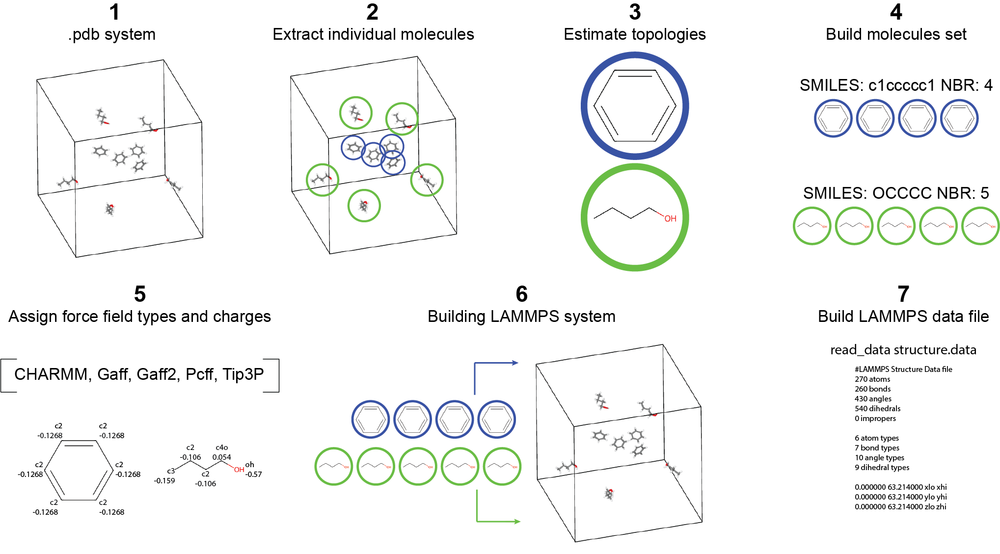
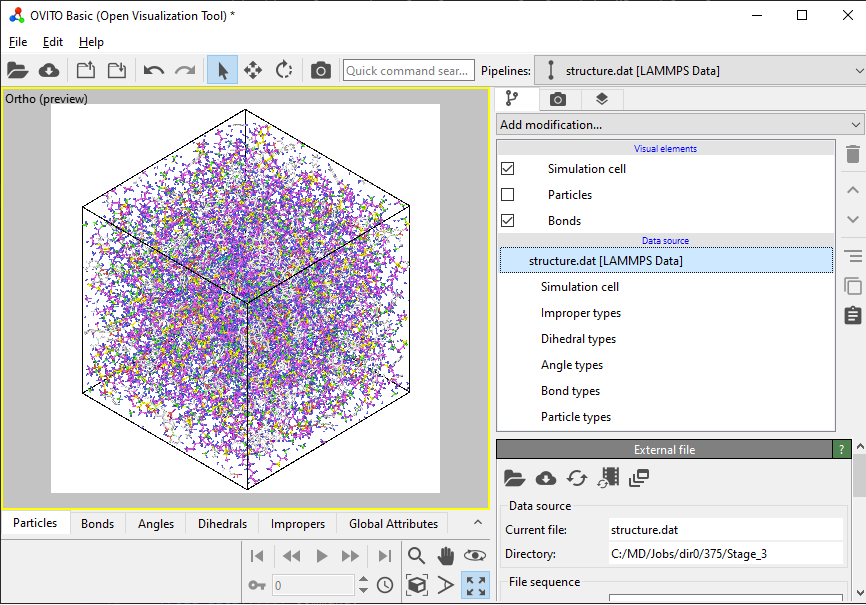
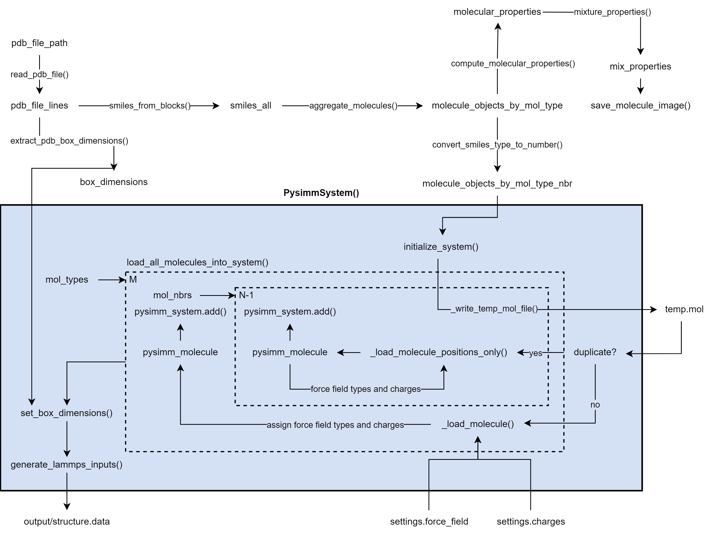

# Pdb2Dat

We present **pdb2dat**, a Python utility that utilizes Rdkit and Pysimm to convert molecular systems from PDB formats
into
LAMMPS-readable structure data files. This tool isolates individual molecules from the PDB file, determines stable
conformers, constructs detailed molecular objects, assigns force field types and charges using various force fields
from Pysimm, and generates topology data files essential for LAMMPS simulations. Despite its simplicity, 'pdb2dat'
has been widely employed in numerous research projects for efficiently converting PDB files into MD simulation-ready
formats, demonstrating its adaptability for integration into high-throughput algorithms
within constrained HPC environments.


## Quick Start

Upon successfully installing [Rdkit](https://www.rdkit.org/),
[Pysimm](https://pysimm.org/download/), and [Numpy](https://numpy.org/), you are ready to run PDB2DAT. PDB2DAT
requires `libxext6` and `libxrender1`
to generate images of molecules. These can be obtained using `apt-get`,
although these are already included in most Linux distributions by default. CodeOcean users must include these for the
program to work.
Follow the steps below to get started:

1. **Run the Command**: Execute the following command in your terminal
   or command prompt:

   ``` bash
   python pdb2dat.py
   ```
   This command initiates the PDB2DAT application, utilizing settings
   specified in the `settings.py` file.
   Note: The capsule in [Code Ocean Capsule #0241504](https://codeocean.com/capsule/0241504/tree) is preconfigured to be executable as-is. Simply
   run `pdb2dat.py`.  
   Note 2: [Pysimm](https://pysimm.org/download/) is not available through a package manager
   like [PiPy](https://pypi.org/). Install it using their
   [GitHub repository](https://github.com/polysimtools/pysimm). The following is CodeOcean's example on how to manually
   install Pysimm into the working environment
   ``` bash
   #!/usr/bin/env bash
   set -e
   
   mkdir /pysimm-stable
   
   curl -L https://github.com/polysimtools/pysimm/archive/refs/heads/master.zip > /pysimm-stable/pysimm.zip
   
   unzip /pysimm-stable/pysimm.zip -d /pysimm-stable
   
   cd /pysimm-stable/pysimm-stable  # Adjust based on the actual extracted directory name
   pip install .
   ```

2. **About the sample `bitumen.pdb`**: The default/included `bitumen.pdb` file
   contains 12 molecules types, 80 molecules in total, corresponding to
   a combination of organic molecules commonly found in MD models of
   bitumen (see <https://doi.org/10.1016/j.matdes.2023.111943>). By
   Default, the program will assign atom types from the GAFF2 force
   field and apply Default atomic charges. For visualizing the
   resulting system, import the created `structure.data` file into a
   molecular visualization software such as [OVITO](https://www.ovito.org/).

3. **Locating the Output**: After the program completes its execution,
   the output will be saved in the `settings.output_dir`. Find the
   generated molecular structure file at:

   ``` none
   {settings.output_dir}/structure.dat
   ```
   The default `structure.data` file produced when executing pdb2dat can be
   downloaded [here](docs_content/structure.data).
4. **Visualizing the Output** The resulting `structure.data` file contains the molecular configuration of the generated
   system, which can be visualized using molecular visualization
   software like [OVITO](https://www.ovito.org/), [VMD](https://www.ks.uiuc.edu/Research/vmd/),
   or [PyMOL](https://pymol.org/).

   The [LAMMPS Data file](https://docs.lammps.org/2001/data_format.html)
   contains the molecular configuration, topologies, and atom types and
   charges of the system given in the PDB file. The following is a screenshot of the resulting `structure.data` file
   produced using the default `bitumen.pdb` visualized using OVITO.
   
5. **Use in LAMMPS** The data file is ready to be read from within LAMMPS input scripts, using the
   [read_data](https://docs.lammps.org/read_data.html) command: `read_data structure.data`. Make sure
   the [styles](https://docs.lammps.org/pair_style.html) are properly defined for the force field used.

## Usage

### The `settings.py` File

The `settings.py` file accepts four inputs, as shown below:

```Python
force_field = "Gaff2"
charges = "Default"
output_dir = "output/"
pdb_file_path = f"input/mixture.pdb"
```

| Parameter       | Common Value        | Description                                                                           |
|-----------------|---------------------|---------------------------------------------------------------------------------------|
| `force_field`   | `Gaff2`             | The force field to be used by PDB2DAT: `CHARMM`, `Gaff`, `Gaff2`, `Pcff`, and `Tip3`. |
| `charges`       | `Default`           | The atomic charges to be assigned, `Default`, `Gasteiger`.                            |
| `output_dir`    | `output/`           | Output directory of the results. For CodeOcean, use `../results/`.                    |
| `pdb_file_path` | `input/mixture.pdb` | Input PDB file path.                                                                  |

### Acceptable File Format of `.PDB`

PDB files are usually used to contain the information of single
molecules, not complete systems. However, they still can be used to
contain multiple independent molecules within a simulation volume. While
PDB files' format is pretty standard, there still exists numerous
variations that can result in issues when in use with PDB2DAT. The
format supported by PDB2DAT follows the following structure:


The first line should contain the whole system's dimensions. The rest
of the file should contain a series of molecule **blocks**. The blocks
are comprised of two parts: the atomic data, and their bonding
information to build the respective molecule. The program is sensitive
to the keywords `CRYST`, `HETATM`, and `CONECT`, which means that
these are expected to be found throughout the lines of the files. The
`HETATM` line should contain (in order) the atom's number within the
system [1], its chemical element [2], the molecule number they
correspond to[4], the spatial positions in x[5], y[6], and z[7].
Other elements in the line are ignored but required for formatting
position.

Example PDB file for two benzene molecules in a simulation box of side
length L = 63.214 Ang:

``` {.plaintext linenos=""}
CRYST1   63.214   63.214   63.214  90.00  90.00  90.00 P 1           1
HETATM    1  C   LIG    1      32.411   30.467   31.622  1.00  0.00           C
HETATM    2  C   LIG    1      32.996   31.733   31.605  1.00  0.00           C
HETATM    3  C   LIG    1      32.192   32.873   31.590  1.00  0.00           C
HETATM    4  C   LIG    1      30.803   32.747   31.592  1.00  0.00           C
HETATM    5  C   LIG    1      30.218   31.481   31.609  1.00  0.00           C
HETATM    6  C   LIG    1      31.022   30.341   31.624  1.00  0.00           C
HETATM    7  H   LIG    1      33.037   29.579   31.634  1.00  0.00           H
HETATM    8  H   LIG    1      34.079   31.831   31.603  1.00  0.00           H
HETATM    9  H   LIG    1      32.649   33.859   31.577  1.00  0.00           H
HETATM   10  H   LIG    1      30.177   33.635   31.581  1.00  0.00           H
HETATM   11  H   LIG    1      29.136   31.383   31.611  1.00  0.00           H
HETATM   12  H   LIG    1      30.566   29.355   31.637  1.00  0.00           H
CONECT    1    2
CONECT    2    3
CONECT    3    4
CONECT    4    5
CONECT    5    6
CONECT    6    1
CONECT    1    7
CONECT    2    8
CONECT    3    9
CONECT    4   10
CONECT    5   11
CONECT    6   12
HETATM   13  C   LIG    2      40.085   22.320   42.008  1.00  0.00           C
HETATM   14  C   LIG    2      41.314   21.932   42.542  1.00  0.00           C
HETATM   15  C   LIG    2      42.390   21.666   41.694  1.00  0.00           C
HETATM   16  C   LIG    2      42.236   21.787   40.313  1.00  0.00           C
HETATM   17  C   LIG    2      41.007   22.175   39.780  1.00  0.00           C
HETATM   18  C   LIG    2      39.932   22.441   40.627  1.00  0.00           C
HETATM   19  H   LIG    2      39.248   22.528   42.668  1.00  0.00           H
HETATM   20  H   LIG    2      41.434   21.838   43.618  1.00  0.00           H
HETATM   21  H   LIG    2      43.347   21.364   42.110  1.00  0.00           H
HETATM   22  H   LIG    2      43.074   21.579   39.653  1.00  0.00           H
HETATM   23  H   LIG    2      40.887   22.269   38.704  1.00  0.00           H
HETATM   24  H   LIG    2      38.974   22.744   40.211  1.00  0.00           H
CONECT   13   14
CONECT   14   15
CONECT   15   16
CONECT   16   17
CONECT   17   18
CONECT   18   13
CONECT   13   19
CONECT   14   20
CONECT   15   21
CONECT   16   22
CONECT   17   23
CONECT   18   24
```

### Obtaining `.PDB` Files

Acquiring [Protein Data Bank (PDB)](https://en.wikipedia.org/wiki/Protein_Data_Bank_(file_format))
files for single molecules is a
straightforward process. Various software, tools, and Python scripts
are capable of generating the 3D conformation of molecules and, subsequently, PDB files.
However, the challenge arises when one needs to produce a PDB file for a mixture of
molecules, requiring these molecules to be distributed or placed within
a simulation volume.

PDB files are widely used, and a multitude of tools are available for
initializing molecular systems or converting them from other prevalent file
formats. The fundamental principle involves the generation of 3D
conformations of molecules, surfaces, pores, or other chemical
structures and their placement within a defined control volume. For such
tasks, licensed software like [Materials
Studio](https://www.3ds.com/products/biovia/materials-studio) or
[Materials Design MedeA](https://www.materialsdesign.com/medea-software)
are suitable. Additionally, open-source tools such as
[PackMol](https://m3g.github.io/packmol/), [PyMol](https://pymol.org/),
[OpenBabel](http://openbabel.org/docs/index.html), and even
[GROMACS](https://www.gromacs.org/) and
[LAMMPS](https://docs.lammps.org/create_atoms.html) facilitate the
creation of atomistic models in PDB format (or to a format that can be
converted into PDB).

PDB2DAT has been developed to work in conjunction with another tool,
SMI2PDB. The latter enables the initialization of PDB files containing
molecular mixtures directly from the molecules' Simplified Molecular
Input Line Entry System
([SMILES](https://en.wikipedia.org/wiki/Simplified_molecular-input_line-entry_system))
notation, along with their number and other chemical parameters.
SMI2PDB supports only the initialization of amorphous organic mixtures
and does not support surfaces, frameworks, crystalline structures, etc.
This makes PDB2DAT sensitive to systems that are not organic mixtures of molecules as well, as its primary intended use
was for these atomic systems in particular.

## Architecture

Starting with the input of a PDB file, the `read_pdb_file()` function is invoked,
reading the file from `settings.pdb_file_path`. The PDB file lines are then processed by the `smiles_from_blocks()`
function, which is tasked with extracting SMILES representations of each molecule from the PDB blocks.

The generation of SMILES notations for each molecule is crucial to obtain bonding information which is commonly not
included in PDB files, especially bond orders above 1 (e.g., double, triple, aromatic). PDB2DAT uses Rdkit's
`rdDetermineBonds.DetermineBondOrders(mol)` function, which encapsulates the functionality of
[Jansen's XYZ2MOL](https://github.com/jensengroup/xyz2mol) package to estimate bonding information from just atomic
elements and their positions in a molecular system that has been subject to some sort of MD/Quantum Mechanics
minimization/equilibrium run.
The latter is essential as this algorithm's effectiveness relies (mostly) on the distance between atomic pairs to
estimate their
bonding information. For example, for Carbon-Carbon atoms:

| Distance [Å] | Bond Type       |
|--------------|-----------------|
| 1.54 Å       | Single (alkane) |
| 1.39 Å       | Aromatic        |
| 1.34 Å       | Double (alkene) |
| 1.20 Å       | Triple (alkyne) |

If for any reason the distance thresholds are not met, wrong bonding orders will be produced. For more information on
how `rdDetermineBonds.DetermineBondOrders(mol)` works,
visit [this link.](https://greglandrum.github.io/rdkit-blog/posts/2022-12-18-introducing-rdDetermineBonds.html)

These SMILES strings are then combined into a set of molecules by `aggregate_molecules()`,
which compiles them into a list with their SMILES notation, number, and other chemical
properties computed using `compute_molecular_properties()`. Optionally, if visualization of the molecular
structures is required, the `save_molecule_image()` function can be employed, using the `Pillow`
library to generate images of the molecules. The latter is enabled by default.
In parallel, the `extract_pdb_box_dimensions()` function is utilized to obtain the dimensions of the
simulation box from the PDB file.

With the chemical system fully described, the molecular system initialization commences.
The `initialize_system()` function prepares the foundation of the Pysimm object for subsequent operations.
The Pysimm system then undergoes population through the `load_all_molecules_into_system()` function,
which iterates through the molecule types and adds them to the system using `pysimm_system.add()`.
This step also includes the assignment of force field types and charges.
If there are duplicate molecules to be added (by duplicates, we mean of the same type, like having 10 molecules of
butanol), the process flow includes a conditional check
to use the force field types and charges already assigned to the molecule's type in the duplicate molecule.
Assigning force field types and charges is a computationally costly task and there is no need to reapply the
same types and charges to molecules of the same kind.

Finally, once the system is populated with all molecules and their properties set,
the `generate_lammps_inputs()` function is invoked to create the input files necessary for LAMMPS simulations.
The output from this process is directed to the `{settings.output_dir}/structure.data` file, which contains the
system's configuration in a format that is readable by LAMMPS.

A flow graph of PDB2DAT is presented as follows:


## License

PDB2DAT is licensed under the GNU General Public License (GPL), which is
a widely used free software license that guarantees end users the
freedom to run, study, share, and modify the software.
The GPL license aims to ensure that the software remains free and
open-source for all its users. For detailed terms and conditions, please
refer to the full license text.
The full text of the GPL license can be found at the official GNU
website or included directly within this documentation.

For the full GPL license text, you may visit the [GNU General Public
License v3.0](https://www.gnu.org/licenses/gpl-3.0.html) website.

If you are using this script for your research, please cite **PDB2DAT: A self-contained Python tool to generate
atomistic systems of organic molecules using their SMILES notations**.

## Credits

The script was created by Eli I. Assaf (e.i.assaf@tudelft.nl), Xueyan Liu, Peng Lin, and Sandra Erkens, all affiliated
at [TU Delft](https://www.tudelft.nl/).
The incentive of producing such script was to normalize the use of Python-based tools to perform MD simulations with
relative ease.

This script is created under the research program Knowledge-based
Pavement Engineering (KPE). KPE is a cooperation between
[Rijkswaterstaat](https://www.rijkswaterstaat.nl/),
[TNO](https://www.tno.nl/nl/), and [TU Delft](https://www.tudelft.nl/)
in which scientific and applied knowledge is gained about asphalt
pavements and which contributes to the aim of Rijkswaterstaat to be
completely climate neutral and to work according to the circular
principle by 2030. The opinions expressed in these papers are solely
from the authors.